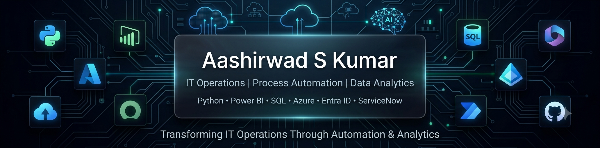

  

 

# 👋 Hi, I'm Aashirwad S Kumar

### 🚀 IT Operations • Process Automation • Data Analytics

---

## 🚀 About Me

💻 Enterprise IT Operations Professional

⚡ Passionate about Process Automation & AI

📊 Building Data Analytics & Power BI Solutions

☁️ Learning Azure Cloud & Enterprise Technologies

🎯 Goal: Build scalable automation that saves time and improves business operations.

---

# 🛠️ Tech Stack

### 💻 Languages

### ☁️ Cloud & Enterprise

### 📊 Analytics

### 🤖 Automation

---

# 🔥 Core Expertise

✅ Windows & macOS Administration

✅ Microsoft Entra ID & Intune (MDM)

✅ ServiceNow (ITSM)

✅ Power BI Dashboards

✅ SQL & Data Analytics

✅ Python Automation

✅ PowerShell Scripting

✅ Microsoft 365 Administration

✅ Process Automation

---

# 📚 Currently Learning

* ☁️ Microsoft Azure (AZ-900)
* 🤖 Microsoft AI (AI-900)
* 📊 Power BI (PL-300)
* 🗄️ Advanced SQL
* ⚙️ Enterprise Automation

---

# 📈 GitHub Stats

---

# 🤝 Connect With Me

📧 **Email:** [aashirwadskumar@gmail.com](mailto:aashirwadskumar@gmail.com)

---

### 🚀 Building Enterprise Automation Solutions with AI, Cloud & Data Analytics

⭐ *If you like my work, consider following my GitHub profile!*

